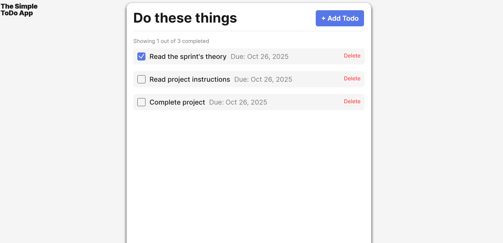

# Simple Todo App

The is a To-do app aimed at giving the user the ability to create tasks with customized due dates. The user is able to delete the tasks as well.

## Functionality

The user is able add, delete, and checkbox all of their tasks. The dates that can be used are within a certain time span.

## Technology

The technologies used for this project are HTML, CSS, and JavaScript.

## Deployment

This project is deployed on GitHub Pages:

(https://rocky-eng-coder.github.io/se_project_todo-app/index.html)

**images**

